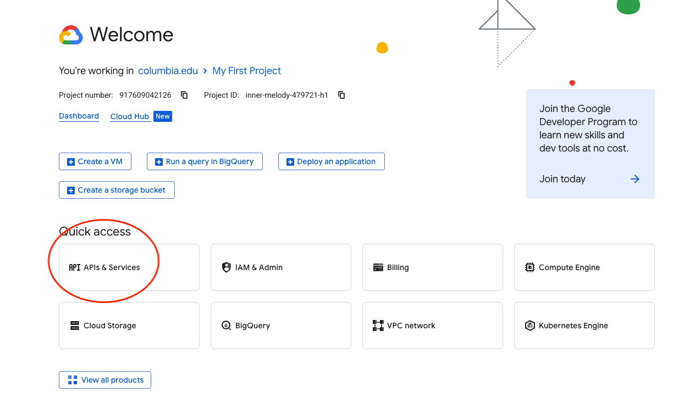
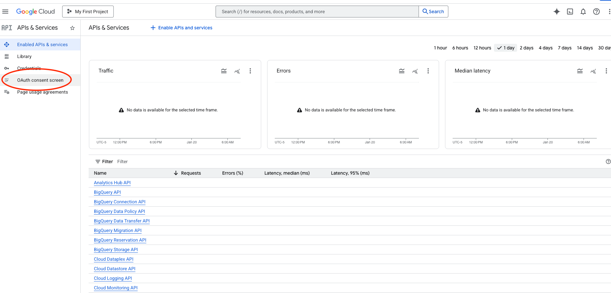
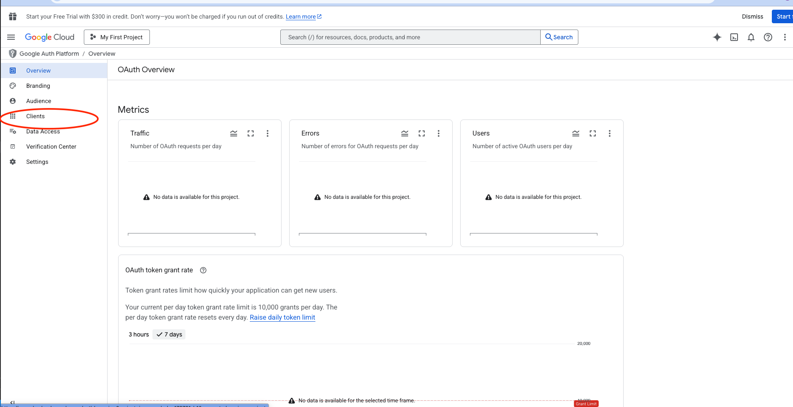
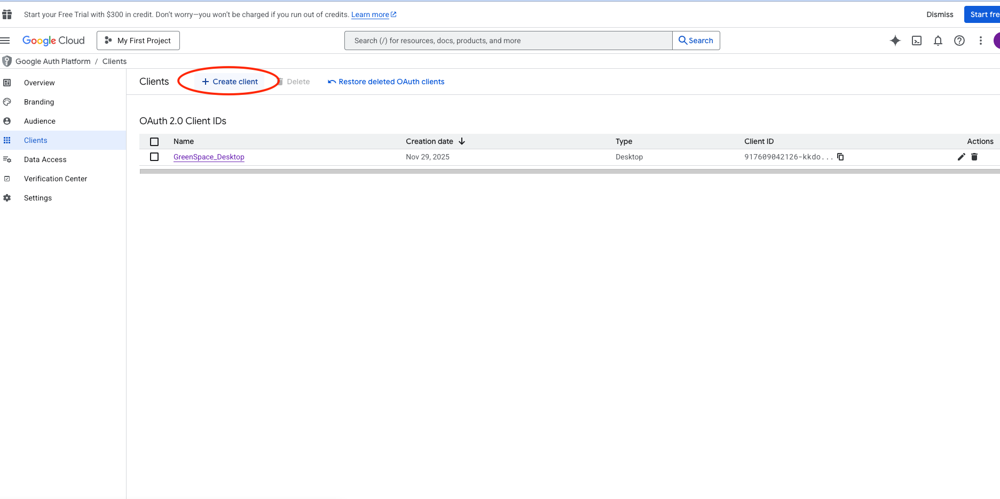

# Google Drive authentication (PyDrive2 OAuth)

This project uses **PyDrive2 OAuth** to access images stored in a shared Google Drive folder.

## What you need
- A Google account that has access to the shared Drive folder
- The Drive folder ID: 1upr61AWU85uyOjVcVWqhJbXeJG296FN4
- An OAuth client secrets JSON file (ask the project owner)

## 1) Put the OAuth client secrets in the repo
### 1A) Download the OAuth client secrets JSON from Google Cloud Console
This is the file you likely “downloaded locally” before.

1. **Open Google Cloud Console → APIs & Services**
   - Select an existing project, or create a new one.





2. **Configure the OAuth consent screen**
   - Go to **OAuth consent screen**
   - Choose **External** (most common) unless your org requires Internal
   - Fill out the required fields (app name + contact email)
   - Add yourself as a **Test user** (important if the app is in “Testing”)



3. **Create an OAuth Client ID**
   - Go to **Credentials → Create Credentials → OAuth client ID**
   - Application type: **Desktop app** (recommended for this notebook workflow)
   - Create it



4. **Download the JSON**
   - In **Credentials**, find the client you created and click **Download JSON**
   - The downloaded filename typically looks like:
     - `client_secret_XXXXXXXX.apps.googleusercontent.com.json`

### 1B) Put the JSON into this repo
Move/rename the downloaded JSON file to:
- `secrets/client_secrets.json`

This path is the default used by `src/drive_utils.py` (and `secrets/` is gitignored).

## 2) Create a `.env` in the project root
Create `./.env` (not committed) and set (copy & paste):

```bash
# Required: Drive folder that contains images
GOOGLE_DRIVE_FOLDER_ID=1upr61AWU85uyOjVcVWqhJbXeJG296FN4
```

Other knobs (defaults shown):

```bash
# If the folder is a Shared Drive, keep this true
GOOGLE_DRIVE_INCLUDE_SHARED=true

# Only list/download images (usually correct)
GOOGLE_DRIVE_MIME_PREFIX="image/"

# Defaults (normally don't change)
GOOGLE_OAUTH_CLIENT_SECRETS="secrets/client_secrets.json"
GOOGLE_OAUTH_CREDENTIALS_CACHE="secrets/credentials.json"
```

## 3) First-time auth flow (browser-based)
When you run the Drive steps in `notebooks/02_data_preprocessing.ipynb`, the code calls:
- `get_drive(use_local_server=True)`

On first run, this triggers `LocalWebserverAuth()`:
- Your browser opens to Google OAuth
- You log in and approve access
- Tokens are cached to `secrets/credentials.json` for future runs

After this, reruns usually **do not** prompt again (tokens refresh automatically).

## If browser auth doesn’t work
If the local webserver flow is blocked (remote machine / SSH / corporate policy), switch to:
- `get_drive(use_local_server=False)` (uses `CommandLineAuth()`)

You can do that in the notebook cell that creates `drive = get_drive(...)`.

