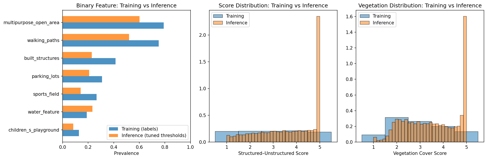

# Process Update — 2026-05-16

## Status Quo

trajectory so far with score & veg (the two multi-head):

- **Iteration 1**: Hard labels (`score_class`, sparse CE) → low accuracy on val
- **Iteration 2**: Soft labels (`score_p_1..5`, categorical CE) → same generalization gap
- **Iteration 3**: Continuous target (`score_mean`, MAE) + oversampling (playground 20%, water_feature 25%) → score MAE improved 7–8%, binary F1 up across weak labels, veg MAE slightly worse (+3.5%). See [0509_process_update.md](0509_process_update.md) for full comparison.
- **Iteration 4 (pending)**: Add sigmoid boundary to regression head to fix inference clipping artifact (see below).

---

## Training set

| label                  | support_pos | support_neg | ROC_AUC | PR_AUC | thr_val | P@thr | R@thr | F1@thr |
| ---------------------- | ----------- | ----------- | ------- | ------ | ------- | ----- | ----- | ------ |
| built_structures       | 1146        | 1619        | 93.77   | 91.24  | 0.551   | 85.02 | 79.76 | 0.823  |
| children_s_playground  | 355         | 2410        | 90.34   | 56.29  | 0.373   | 51.27 | 68.45 | 0.586  |
| multipurpose_open_area | 2188        | 577         | 95.22   | 98.57  | 0.342   | 92.73 | 96.21 | 0.944  |
| parking_lots           | 855         | 1910        | 95.34   | 90.62  | 0.323   | 77.61 | 88.77 | 0.828  |
| sports_field           | 736         | 2029        | 96.50   | 92.49  | 0.416   | 81.66 | 87.09 | 0.843  |
| walking_paths          | 2077        | 688         | 93.68   | 97.73  | 0.450   | 90.65 | 93.40 | 0.920  |
| water_feature          | 522         | 2243        | 86.66   | 70.36  | 0.376   | 57.05 | 66.67 | 0.615  |

---

## Validation set

| label                  | support_pos | support_neg | ROC_AUC | PR_AUC | thr_val | P@thr | R@thr | F1@thr |
| ---------------------- | ----------- | ----------- | ------- | ------ | ------- | ----- | ----- | ------ |
| built_structures       | 379         | 543         | 93.12   | 91.00  | 0.551   | 85.31 | 79.68 | 0.824  |
| children_s_playground  | 102         | 820         | 84.95   | 41.93  | 0.373   | 36.31 | 55.88 | 0.440  |
| multipurpose_open_area | 724         | 198         | 94.35   | 98.15  | 0.342   | 92.48 | 96.82 | 0.946  |
| parking_lots           | 264         | 658         | 93.96   | 86.21  | 0.323   | 70.36 | 89.02 | 0.786  |
| sports_field           | 260         | 662         | 95.51   | 91.60  | 0.416   | 83.27 | 84.23 | 0.837  |
| walking_paths          | 685         | 237         | 92.30   | 96.29  | 0.450   | 91.48 | 94.01 | 0.927  |
| water_feature          | 178         | 744         | 83.53   | 63.03  | 0.376   | 52.61 | 62.36 | 0.571  |

---

## Test set

| label                  | support_pos | support_neg | ROC_AUC | PR_AUC | thr_val | P@thr | R@thr | F1@thr |
| ---------------------- | ----------- | ----------- | ------- | ------ | ------- | ----- | ----- | ------ |
| built_structures       | 354         | 568         | 93.08   | 87.75  | 0.551   | 82.70 | 79.66 | 0.812  |
| children_s_playground  | 114         | 808         | 86.28   | 46.44  | 0.373   | 40.54 | 52.63 | 0.458  |
| multipurpose_open_area | 714         | 208         | 92.52   | 97.31  | 0.342   | 90.47 | 94.40 | 0.924  |
| parking_lots           | 265         | 657         | 93.29   | 84.02  | 0.323   | 71.20 | 84.91 | 0.775  |
| sports_field           | 238         | 684         | 95.73   | 90.39  | 0.416   | 79.92 | 80.25 | 0.801  |
| walking_paths          | 678         | 244         | 93.69   | 97.07  | 0.450   | 92.09 | 94.40 | 0.932  |
| water_feature          | 194         | 728         | 82.75   | 64.77  | 0.376   | 58.13 | 60.82 | 0.594  |

*(P@thr and R@thr are percentages from the CSV; ROC_AUC and PR_AUC are shown as in the file.)*

---

## Two weakest binary labels

**children_s_playground** and **water_feature** remain the **lowest F1@thr** on the **test** split (0.458 and 0.594 respectively), with **rarer positives** (`support_pos` 114 and 194 on test) than the high-prevalence classes—so harder learning and noisier estimates are expected.

---

## Interpreting “recall better than precision” (at the tuned threshold)

Precision = of all images the model flags as positive, how many actually are. Lower precision means more false alarms.
Recall = of all images that actually are positive, how many the model catches. Higher recall means fewer missed detections.
Our model catches most real positives but raises extra false alarms.

---

## Inference outcome (run `20260511_200157`, 15,019 images)

### 1. Binary head (including shade)

| Label                  | Predicted positive | Prevalence |
| ---------------------- | ------------------ | ---------- |
| multipurpose_open_area | 9,027              | 60.1%      |
| walking_paths          | 7,808              | 52.0%      |
| water_feature          | 3,502              | 23.3%      |
| built_structures       | 3,422              | 22.8%      |
| parking_lots           | 3,111              | 20.7%      |
| sports_field           | 2,112              | 14.1%      |
| children_s_playground  | 1,246              | 8.3%       |

**Shade:** abundant 53.9%, minimal 46.1%.

Binary prevalence tracks training proportions — high-prevalence labels stay on top, rare labels stay lowest. No major domain-gap red flags.

### 2. Multi-head (score & veg)

| Metric                 | Score         | Veg          |
| ---------------------- | ------------- | ------------ |
| Mean                   | 3.71          | 3.54         |
| Range                  | 1.00 – 5.00   | 1.00 – 5.00  |
| Clipped to exactly 5.0 | 3,786 (25.2%) | 1,403 (9.3%) |

**Issue:** Both distributions show a large spike at exactly 5.0. This is an artifact — the regression head predicts values above 5.0, and `np.clip(pred, 1, 5)` squashes them to exactly 5.0.

---

## Why the spike exists (unbounded regression)

**What changed:** Under softmax, score/veg were predicted as probability distributions over five classes. The expected value (`probs @ [1,2,3,4,5]`) was mathematically bounded to [1, 5] — no matter how confident the model was, the output could never exceed 5.0. When we switched to `Dense(1, activation=None)` for continuous regression, that implicit bound was removed.

**Why training still worked:** During training, all targets are in [1, 5], so the loss (MAE) naturally pushes predictions toward that range. The model learns “reasonable” outputs because overshooting increases error. Training metrics (score MAE 0.636, down from 0.691) improved because the model could predict fine-grained values without forcing them through five bins.

**Why inference breaks:** On unseen images that differ from training data, the model encounters cases it considers strong class-5 candidates and overshoots (e.g., predicting 5.3 or 6.1).

**Question:** What is the recommended way to constrain regression output to a fixed range [1, 5] without losing the benefits of continuous prediction?

---

