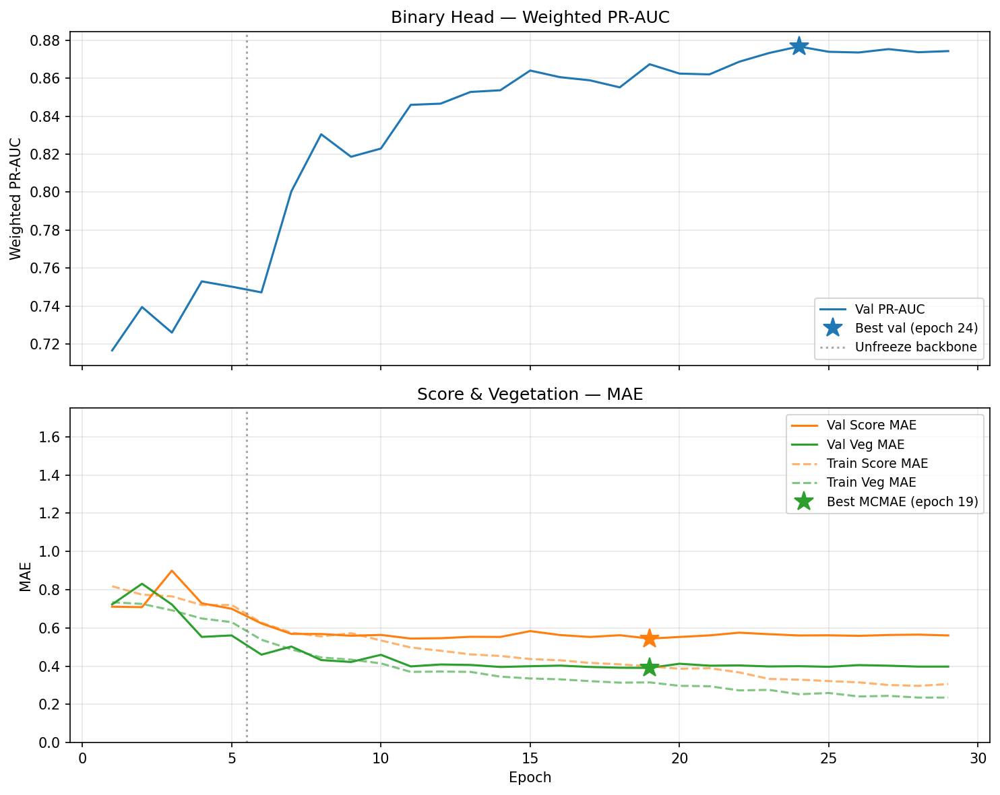

# Process Update — 2026-08-02

## Local Best-MCMAE Comparison

| Test metric | Previous local run<br>`PyTorch_20260614_220926` | Current local evaluation<br>`PyTorch_20260719_full_windows_local_eval_0802` | Delta |
| --- | ---: | ---: | ---: |
| Macro PR-AUC | 0.888 | 0.877 | -0.011 |
| Macro ROC-AUC | 0.939 | 0.935 | -0.004 |
| Tuned macro F1 | 0.824 | 0.806 | -0.018 |
| Shade accuracy, conditional | 0.668 | 0.693 | +0.025 |
| Score MAE vs. rater mean | 0.576 | 0.558 | -0.018 |
| Vegetation MAE vs. rater mean | 0.430 | 0.417 | -0.013 |

Binary ranking and tuned F1 declined slightly, while shade accuracy and both
continuous MAE outcomes improved. The runs use different regenerated test
splits, so the deltas are directional rather than a controlled same-split
comparison.

## Script Annotation Example

Before:

```python
predictions_by_split = {
    split: predict_split(model, split, device=device)
    for split in ("train", "val", "test")
}
```

After:

```python
# Run inference once on train, validation, and test.
predictions_by_split = {
    split: predict_split(model, split, device=device)
    for split in ("train", "val", "test")
}
```

All 15 Python entry-point scripts now use concise workflow-stage annotations;
no program behavior changed.

## July Training History



The run completed 5 warm-up and 24 fine-tuning epochs. The visual uses global
epoch numbering, so fine-tuning epoch 24 is global epoch 29; the epoch-24 star
marks the best validation PR-AUC, not the stopping point.

## Reviewer Inference Test

The packaged best-MCMAE bundle passed CPU validation and inference on all 50
review images. It generated `predictions_review_test_v1.csv` with 50 rows, 19
columns, no duplicate filenames, and no missing values.

## Fresh-Clone Reviewer Walkthrough

GitHub `main` now includes the packaged validation and inference workflow at
commit `19b0651`. From the cloned repository root:

1. Create Python 3.11 environment and install dependencies.

   ```bash
   python3.11 -m venv .venv
   source .venv/bin/activate
   python -m pip install --upgrade pip
   python -m pip install -r requirements.txt
   ```

   On Windows, use `py -3.11 -m venv .venv` and
   `.venv\Scripts\Activate.ps1` instead.

2. Extract the downloaded files into this layout:

   ```text
   models/runs/PyTorch_20260719_full_windows/
     best_mcmae_PyTorch_20260719_full_windows.pt
     model_config_PyTorch_20260719_full_windows.json
     thresholds_best_mcmae.csv

   data/cache/test_inference_images/
     <50 JPG images>
   ```

3. Validate the environment, model bundle, and images.

   ```bash
   python scripts/validate_pipeline.py \
     --run-dir models/runs/PyTorch_20260719_full_windows \
     --skip-data \
     --inference-dir data/cache/test_inference_images \
     --device cpu
   ```

4. Generate predictions.

   ```bash
   python scripts/predict_torch.py \
     --run-dir models/runs/PyTorch_20260719_full_windows \
     --image-dir data/cache/test_inference_images \
     --dataset-tag review_test_v1 \
     --device cpu
   ```

5. Open
   `predictions/predictions_PyTorch_20260719_full_windows_review_test_v1.csv`.

The evaluation script is not required for these unlabeled review images. It
requires the labeled train/validation/test manifests and their rated images.
