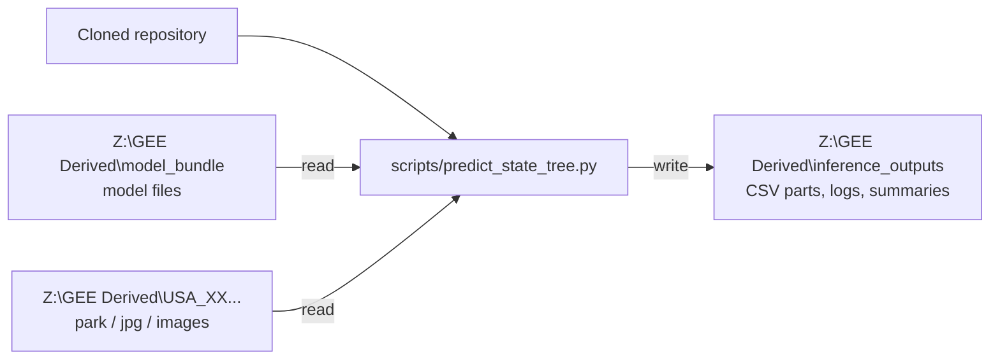

# Process Update — 2026-09-07

## Windows Workstation Inference Walkthrough — Part 1

### Purpose

Confirm whether the GreenSpace Python environment can use the workstation's
NVIDIA T1000 for CUDA inference. Do not start the full dataset yet.

Known workstation hardware:

- two Intel Xeon Gold 5315Y CPUs: 16 physical cores and 32 logical processors total;
- 511.66 GB system RAM;
- NVIDIA T1000 with 4 GB dedicated GPU memory.

The T1000 supports CUDA, but the driver, remote Windows session, and installed
PyTorch environment must also expose it.

## Step 1 — Open PowerShell

Connect to the workstation, open the Windows Start menu, search for
`PowerShell`, and open it.

## Step 2 — Check the NVIDIA driver

Run:

```powershell
nvidia-smi
```

Expected result: a table listing `NVIDIA T1000`, an NVIDIA driver version, GPU
memory, and a CUDA version.

- If the table appears, continue to Step 3.
- If PowerShell says the command is not recognized or returns an error, copy or
  screenshot the complete message and stop. Do not start full inference.

The CUDA version shown by `nvidia-smi` is the version supported by the driver.
It does not prove that the project’s PyTorch installation can use CUDA.

## Step 3 — Enter the project environment

Go to the cloned repository, replacing the example path with its real location:

```powershell
cd "C:\path\to\GreenSpace_CNN"
```

Activate the environment created from the README:

```powershell
.\.venv\Scripts\Activate.ps1
```

Check Python:

```powershell
python --version
```

The project expects Python 3.11 or 3.12; Python 3.11 is the tested version.

## Step 4 — Check CUDA inside PyTorch

Copy and run this one command:

```powershell
python -c "import torch; print('PyTorch:', torch.__version__); print('CUDA available:', torch.cuda.is_available()); print('PyTorch CUDA:', torch.version.cuda); print('GPU:', torch.cuda.get_device_name(0) if torch.cuda.is_available() else 'none')"
```

### Successful result

The important lines should resemble:

```text
CUDA available: True
GPU: NVIDIA T1000
```

This means the project environment can use CUDA.

### Unsuccessful result

- `No module named torch`: the repository dependencies are not installed in the
  active environment. Follow the README installation step, then repeat Step 4.
- `CUDA available: False`: do not guess or install additional CUDA software yet.
  Save the complete output from Steps 2 and 4 for troubleshooting.

## Step 5 — Record the result

Save or send:

1. the complete `nvidia-smi` output;
2. the complete PyTorch check output;
3. the Python version;
4. confirmation that the commands were run inside the repository's `.venv`.

## Initial inference settings

If Step 4 reports `CUDA available: True`, begin the later smoke test with:

```text
--device cuda --batch-size 1 --num-workers 2 --pin-memory
```

The T1000 has only 4 GB of GPU memory, so batch size 1 is the safe starting
point. Increase it only after a small inference test succeeds.

If CUDA is unavailable and CPU inference is required, begin with:

```text
--device cpu --batch-size 1 --num-workers 2 --no-pin-memory
```

`--batch-size` controls how many images the model processes together. It does
not control the number of rows written to each output CSV.

## Windows Workstation Inference Walkthrough — Part 2

### Current status

`scripts/predict_state_tree.py` is implemented and locally tested. It still
needs to be verified on the Windows workstation before a full run.

The script stays inside the cloned repository. It reads the existing images
and model from `Z:` and writes only to `Z:\GEE Derived\inference_outputs`.
It does not move or rename source images.



### Step 1 — Set the four paths

Open PowerShell, enter the cloned repository, and activate `.venv` as shown in
Part 1. Then set these variables. Replace only `$Repo` and `$Checkpoint` if
their real locations differ.

```powershell
$Repo = "C:\path\to\GreenSpace_CNN"
$ImageRoot = "Z:\GEE Derived"
$OutputRoot = "Z:\GEE Derived\inference_outputs"
$Checkpoint = "Z:\GEE Derived\model_bundle\PyTorch_20260719_full_windows\best_mcmae_PyTorch_20260719_full_windows.pt"

cd $Repo
.\.venv\Scripts\Activate.ps1
```

The checkpoint, `model_config_PyTorch_20260719_full_windows.json`, and
`thresholds_best_mcmae.csv` must be in the same folder. If the downloaded zip
contains an extra `transfer_file` folder, point `$Checkpoint` to the `.pt` file
inside that folder. Do not guess or move only the `.pt` file.

Check the paths:

```powershell
Test-Path $ImageRoot
Test-Path $Checkpoint
Test-Path (Join-Path (Split-Path $Checkpoint) "model_config_PyTorch_20260719_full_windows.json")
Test-Path (Join-Path (Split-Path $Checkpoint) "thresholds_best_mcmae.csv")
```

All four results must be `True` before prediction.

The commands below assume Part 1 reported `CUDA available: True`. If it did
not, use `--device cpu --no-pin-memory` instead; do not install or change CUDA
during this walkthrough.

### Step 2 — Inventory Alabama without loading the model

Use a new `--run-id` each time a new inventory or test is started.

```powershell
python scripts/predict_state_tree.py `
  --image-root $ImageRoot `
  --output-dir $OutputRoot `
  --run-id "AL_inventory_01" `
  --states AL `
  --inventory-only
```

Review:

```powershell
Get-Content "$OutputRoot\AL_inventory_01\run_summary.json"
Import-Csv "$OutputRoot\AL_inventory_01\inventory\USA_AL_inventory.csv" | Select-Object -First 5
```

Stop if the state folder is missing, more than one top-level folder resolves
to `AL`, the inventory is empty, or the example paths do not match File
Explorer.

### Step 3 — Optional exact-image check

This command demonstrates the exact example supplied for Alabama. Confirm the
file exists first.

```powershell
$ExampleImage = "Z:\GEE Derived\USA_AL_2023_Full-20260709T203911Z-2-001\USA_AL_2023_Full\04033-1402\jpg\04033-1402_1_export0_USA_AL_04033-1402_1_0-00000_p00000.jpg"
Test-Path $ExampleImage

python scripts/predict_state_tree.py `
  --checkpoint $Checkpoint `
  --image-root $ImageRoot `
  --output-dir $OutputRoot `
  --run-id "AL_exact1_01" `
  --image-path $ExampleImage `
  --device cuda `
  --batch-size 1 `
  --num-workers 2 `
  --pin-memory
```

If `Test-Path` is `False`, do not run the command; select the correct path from
the inventory instead.

### Step 4 — Required 5-image smoke test

The five images are the first five paths in deterministic sorted order, not a
random sample.

```powershell
python scripts/predict_state_tree.py `
  --checkpoint $Checkpoint `
  --image-root $ImageRoot `
  --output-dir $OutputRoot `
  --run-id "AL_smoke5_01" `
  --states AL `
  --max-images 5 `
  --device cuda `
  --batch-size 1 `
  --num-workers 2 `
  --pin-memory
```

Check the summary and log:

```powershell
Get-Content "$OutputRoot\AL_smoke5_01\run_summary.json"
Get-Content "$OutputRoot\AL_smoke5_01\logs\inference.log" -Tail 30
```

The summary must say `status: complete` and satisfy:

```text
images_attempted = images_succeeded + images_failed
```

Unreadable images appear in the matching `failures_*.csv`. CUDA, model,
schema, and output errors stop the run.

### Step 5 — Run the 1,000-image test

Only continue after the 5-image smoke test succeeds.

```powershell
python scripts/predict_state_tree.py `
  --checkpoint $Checkpoint `
  --image-root $ImageRoot `
  --output-dir $OutputRoot `
  --run-id "AL_test1000_01" `
  --states AL `
  --max-images 1000 `
  --images-per-part 1000 `
  --device cuda `
  --batch-size 1 `
  --num-workers 2 `
  --pin-memory
```

This creates one prediction CSV part and one failure CSV part under:

```text
Z:\GEE Derived\inference_outputs\AL_test1000_01\states\USA_AL\
```

### If a run is interrupted

Repeat the exact same command and add `--resume`. Do not change its paths,
state, limits, part size, or device settings. The script validates completed
parts and skips only those that are complete.

### Still unknown until the live walkthrough

- whether CUDA is available to this PyTorch environment;
- the cloned repository's final Windows path;
- the extracted checkpoint's final path, including whether `transfer_file`
  remains in it;
- whether the Windows account can read `Z:` and write `inference_outputs`;
- whether every state follows the reported folder pattern.

Do not start multi-state inference until these checks and both smoke tests pass.
