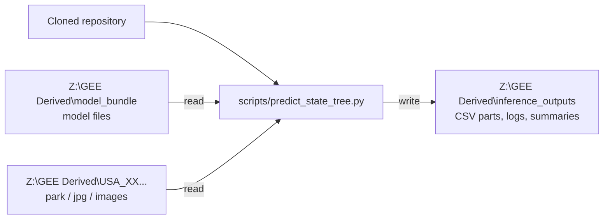

# Process Update — 2026-09-07

## Windows Workstation Inference Walkthrough — Part 1

### Purpose

Confirm whether the GreenSpace Python environment can use the workstation's
NVIDIA T1000 for CUDA inference. Do not start the full dataset yet.

Known workstation hardware:

- two Intel Xeon Gold 5315Y CPUs: 16 physical cores and 32 logical processors total;
- 511.66 GB system RAM;
- NVIDIA T1000 with 4 GB dedicated GPU memory.
- NVIDIA driver 528.24; `nvidia-smi` reports CUDA 12.0.

The T1000 supports CUDA, but the driver, remote Windows session, and installed
PyTorch environment must also expose it.

## Step 1 — Open PowerShell

Connect to the workstation, open the Windows Start menu, search for
`PowerShell`, and open it.

## Step 2 — Check the NVIDIA driver

Run:

```powershell
nvidia-smi
```

Expected result: a table listing `NVIDIA T1000`, an NVIDIA driver version, GPU
memory, and a CUDA version.

- If the table appears, continue to Step 3.
- If PowerShell says the command is not recognized or returns an error, copy or
  screenshot the complete message and stop. Do not start full inference.

The CUDA version shown by `nvidia-smi` is the version supported by the driver.
It does not prove that the project’s PyTorch installation can use CUDA.

## Step 3 — Create and use the project environment

Go to the cloned repository:

```powershell
cd "C:\Users\knobep01\Documents\Repositories\GreenSpace_CNN"
```

The virtual environment is created after cloning; it is not stored in Git. On
this workstation, Python 3.12 is installed:

```powershell
py -3.12 -m venv .venv
```

Successful creation normally returns to the prompt without printing anything.
PowerShell policy on this workstation blocks `Activate.ps1`. Activation is
optional, so use the environment's Python directly:

```powershell
$Python = (Resolve-Path ".\.venv\Scripts\python.exe").Path
& $Python --version
& $Python -m pip install -r requirements.txt
```

Use `& $Python` in every later Python command. This ensures the project uses
the packages installed in `.venv` without changing PowerShell security policy.

## Step 4 — Check CUDA inside PyTorch

Copy and run this one command:

```powershell
& $Python -c "import torch; print('PyTorch:', torch.__version__); print('CUDA available:', torch.cuda.is_available()); print('PyTorch CUDA:', torch.version.cuda); print('GPU:', torch.cuda.get_device_name(0) if torch.cuda.is_available() else 'none')"
```

### Successful result

The important lines should resemble:

```text
CUDA available: True
GPU: NVIDIA T1000
```

This means the project environment can use CUDA.

### Unsuccessful result

- `No module named torch`: the repository dependencies are not installed in the
  virtual environment. Run the requirements command in Step 3, then repeat
  Step 4.
- `PyTorch: 2.10.0+cpu` and `PyTorch CUDA: None`: the environment contains the
  CPU-only PyTorch package. This is separate from the working NVIDIA driver.
- `CUDA available: False`: save the complete output from Steps 2 and 4. Do not
  install a system CUDA toolkit or change the NVIDIA driver during this test.

For this workstation, the no-driver-change test replaces only the two PyTorch
packages inside `.venv` with PyTorch's official CUDA 12.6 build:

```powershell
& $Python -m pip install --force-reinstall torch==2.10.0 torchvision==0.25.0 --index-url https://download.pytorch.org/whl/cu126
```

Repeat Step 4 after the command finishes. Do not proceed with CUDA inference
unless it reports `CUDA available: True` and `GPU: NVIDIA T1000`.

## Step 5 — Record the result

Save or send:

1. the complete `nvidia-smi` output;
2. the complete PyTorch check output;
3. the Python version;
4. confirmation that the commands were run inside the repository's `.venv`.

## Initial inference settings

If Step 4 reports `CUDA available: True`, the complete smoke-test command in
Part 2 uses CUDA, batch size 1, two image-loading workers, and pinned memory.
Do **not** paste options such as `--device cuda` into PowerShell by themselves.
They are inputs to `predict_state_tree.py`, not standalone PowerShell commands.

The T1000 has only 4 GB of GPU memory, so batch size 1 is the safe starting
point. Increase it only after a small inference test succeeds.

If CUDA is unavailable and CPU inference is required, replace `--device cuda`
with `--device cpu` and replace `--pin-memory` with `--no-pin-memory` in the
complete command.

`--batch-size` controls how many images the model processes together. It does
not control the number of rows written to each output CSV.

`--num-workers` controls how many background processes load and prepare
images. Two workers are used first to verify the Windows fix. It does not
change prediction values.

## Windows Workstation Inference Walkthrough — Part 2

### Current status

`scripts/predict_state_tree.py` is implemented and locally tested. It still
needs to be verified on the Windows workstation before a full run.

The September 16 exact-image test confirmed that the model loads on CUDA, but
Windows could not start two loader workers because the image transform was a
nested function. The transform is now a module-level picklable callable. A
forced Windows-style `spawn` test and a real-checkpoint two-worker inference
both pass locally. The PI must pull this change and repeat the exact-image test
to complete Windows verification.

The script stays inside the cloned repository. It reads the existing images
and model from `Z:` and writes only to `Z:\GEE Derived\inference_outputs`.
It does not move or rename source images.



### Step 1 — Set the paths

Open PowerShell and set these variables. Replace `$Checkpoint` if its final
extracted location differs.

```powershell
$Repo = "C:\Users\knobep01\Documents\Repositories\GreenSpace_CNN"
$ImageRoot = "Z:\GEE Derived"
$OutputRoot = "Z:\GEE Derived\inference_outputs"
$Checkpoint = "Z:\GEE Derived\model_bundle\PyTorch_20260719_full_windows\best_mcmae_PyTorch_20260719_full_windows.pt"

cd $Repo
$Python = (Resolve-Path ".\.venv\Scripts\python.exe").Path
```

The checkpoint, `model_config_PyTorch_20260719_full_windows.json`, and
`thresholds_best_mcmae.csv` must be in the same folder. If the downloaded zip
contains an extra `transfer_file` folder, point `$Checkpoint` to the `.pt` file
inside that folder. Do not guess or move only the `.pt` file.

Check the paths:

```powershell
Test-Path $ImageRoot
Test-Path $Checkpoint
Test-Path $Python
Test-Path (Join-Path (Split-Path $Checkpoint) "model_config_PyTorch_20260719_full_windows.json")
Test-Path (Join-Path (Split-Path $Checkpoint) "thresholds_best_mcmae.csv")
```

All five results must be `True` before prediction.

The commands below assume Part 1 reported `CUDA available: True`. If it did
not, use `--device cpu --no-pin-memory` instead; do not install or change CUDA
during this walkthrough.

### Step 2 — Pull and confirm the Windows worker fix

Pull the current repository code:

```powershell
git pull
Select-String -Path "src_torch\transforms.py" -Pattern "class _ImageTensorTransform"
```

The second command must print a matching line. That class is the code change
that lets Windows transfer the image transform to background workers. If no
match appears, stop: the workstation does not yet have the fix.

### Step 3 — Inventory Alabama without loading the model (already verified)

This step succeeded during the previous walkthrough with the PI. Skip it for
the worker-only retest unless the Alabama image folders have changed.

Use a new `--run-id` each time a new inventory or test is started.

```powershell
& $Python scripts\predict_state_tree.py `
  --image-root $ImageRoot `
  --output-dir $OutputRoot `
  --run-id "AL_inventory_01" `
  --states AL `
  --inventory-only
```

Review:

```powershell
Get-Content "$OutputRoot\AL_inventory_01\run_summary.json"
Import-Csv "$OutputRoot\AL_inventory_01\inventory\USA_AL_inventory.csv" | Select-Object -First 5
```

Stop if the state folder is missing, more than one top-level folder resolves
to `AL`, the inventory is empty, or the example paths do not match File
Explorer.

### Step 4 — Verify the worker fix with one exact image

This deliberately uses two workers, matching the setting that exposed the old
Windows error. Confirm the example file exists first.

```powershell
$ExampleImage = "Z:\GEE Derived\USA_AL_2023_Full-20260709T203911Z-2-001\USA_AL_2023_Full\04033-1402\jpg\04033-1402_1_export0_USA_AL_04033-1402_1_0-00000_p00000.jpg"
Test-Path $ExampleImage
```

If the PowerShell prompt shows `>>`, press `Ctrl+C` once to cancel the
incomplete command. Then copy and run this **entire line**:

```powershell
& $Python scripts\predict_state_tree.py --checkpoint $Checkpoint --image-root $ImageRoot --output-dir $OutputRoot --run-id "AL_exact1_workers2_01" --image-path $ExampleImage --device cuda --batch-size 1 --num-workers 2 --pin-memory
```

If `Test-Path` is `False`, do not run the command; select the correct path from
the inventory instead.

Success should include `device=cuda`, `workers=2`, `attempted=1`, `succeeded=1`,
`failed=0`, and `Run complete` in the log output.

These are two different errors:

- `Unexpected token 'device'` means options beginning with `--` were pasted
  without the Python command. It is a PowerShell command-entry error; rerun the
  complete one-line command above.
- `Can't get local object` means the old, non-transferable image transform is
  still being used. Stop and confirm Step 2 printed the expected class.

If necessary, `--num-workers 0` remains a safe single-process fallback. It
does not disable CUDA or change predictions, but it does not verify the new
two-worker fix.

### Step 5 — Required 5-image smoke test

The five images are the first five paths in deterministic sorted order, not a
random sample.

```powershell
& $Python scripts\predict_state_tree.py `
  --checkpoint $Checkpoint `
  --image-root $ImageRoot `
  --output-dir $OutputRoot `
  --run-id "AL_smoke5_01" `
  --states AL `
  --max-images 5 `
  --device cuda `
  --batch-size 1 `
  --num-workers 2 `
  --pin-memory
```

Check the summary and log:

```powershell
Get-Content "$OutputRoot\AL_smoke5_01\run_summary.json"
Get-Content "$OutputRoot\AL_smoke5_01\logs\inference.log" -Tail 30
```

The summary must say `status: complete` and satisfy:

```text
images_attempted = images_succeeded + images_failed
```

Unreadable images appear in the matching `failures_*.csv`. CUDA, model,
schema, and output errors stop the run.

### Step 6 — Run the 1,000-image test

Only continue after the 5-image smoke test succeeds.

```powershell
& $Python scripts\predict_state_tree.py `
  --checkpoint $Checkpoint `
  --image-root $ImageRoot `
  --output-dir $OutputRoot `
  --run-id "AL_test1000_01" `
  --states AL `
  --max-images 1000 `
  --images-per-part 1000 `
  --device cuda `
  --batch-size 1 `
  --num-workers 2 `
  --pin-memory
```

Keep two workers for this first workstation trial. Test four workers later as
a separate performance comparison, after the two-worker fix is verified.
Worker count can affect speed, but not prediction values.

This creates one prediction CSV part and one failure CSV part under:

```text
Z:\GEE Derived\inference_outputs\AL_test1000_01\states\USA_AL\
```

### If a run is interrupted

Repeat the exact same command and add `--resume`. Do not change its paths,
state, limits, part size, or device settings. The script validates completed
parts and skips only those that are complete.

### Still unknown until the live walkthrough

- whether the picklable-transform change succeeds with two workers on Windows;
- the extracted checkpoint's final path, including whether `transfer_file`
  remains in it;
- whether the Windows account can read `Z:` and write `inference_outputs`;
- whether every state follows the reported folder pattern.

Do not start multi-state inference until these checks and both smoke tests pass.
